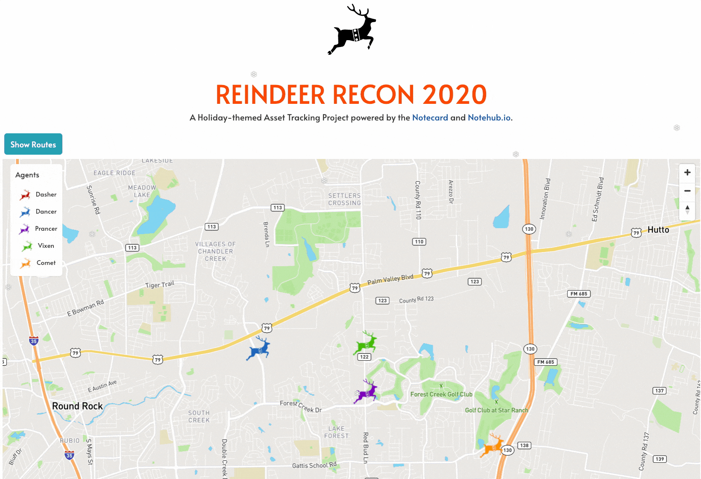

# Reindeer Recon 2020

A Holiday-themed Asset Tracking Project powered by the [Notecard](https://blues.io) and [Notehub.io](https://notehub.io).

This repository contains the complete source for the Reindeer Recon project, including:

- A [configuration script](config/reindeer-tracker.json) for setting-up the Notecard and Notecarrier-AL as a standalone asset tracker.
- Azure Functions for [storing tracker data](functions/reindeerFunctions/saveReindeerLocation/index.js) in CosmosDB, and [retrieving tracker data](functions/reindeerFunctions/getReindeerLocations/index.js) for the web dashboard.
- A [SvelteJS and Mapbox app](dashboard/) for displaying animated tracker data.

## Other Resources

- [Blues Wireless Developer Portal](https://dev.blues.io)
- [Blue Wireless Forum](https://discuss.blues.io)
- [Blues Wireless on Twitter](https://twitter.com/blueswireless)